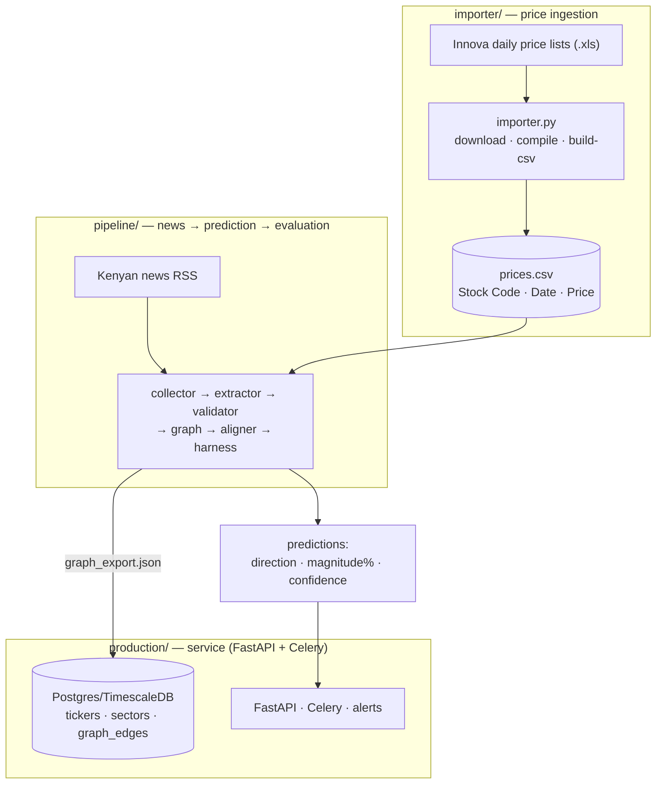
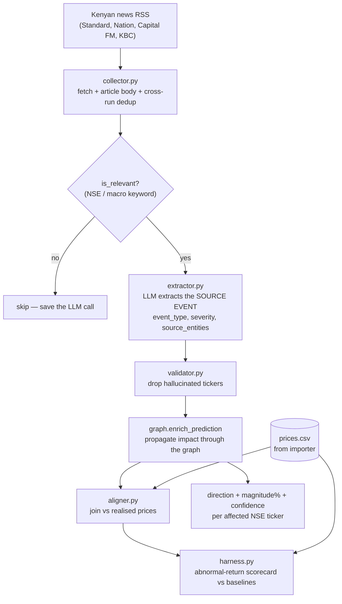
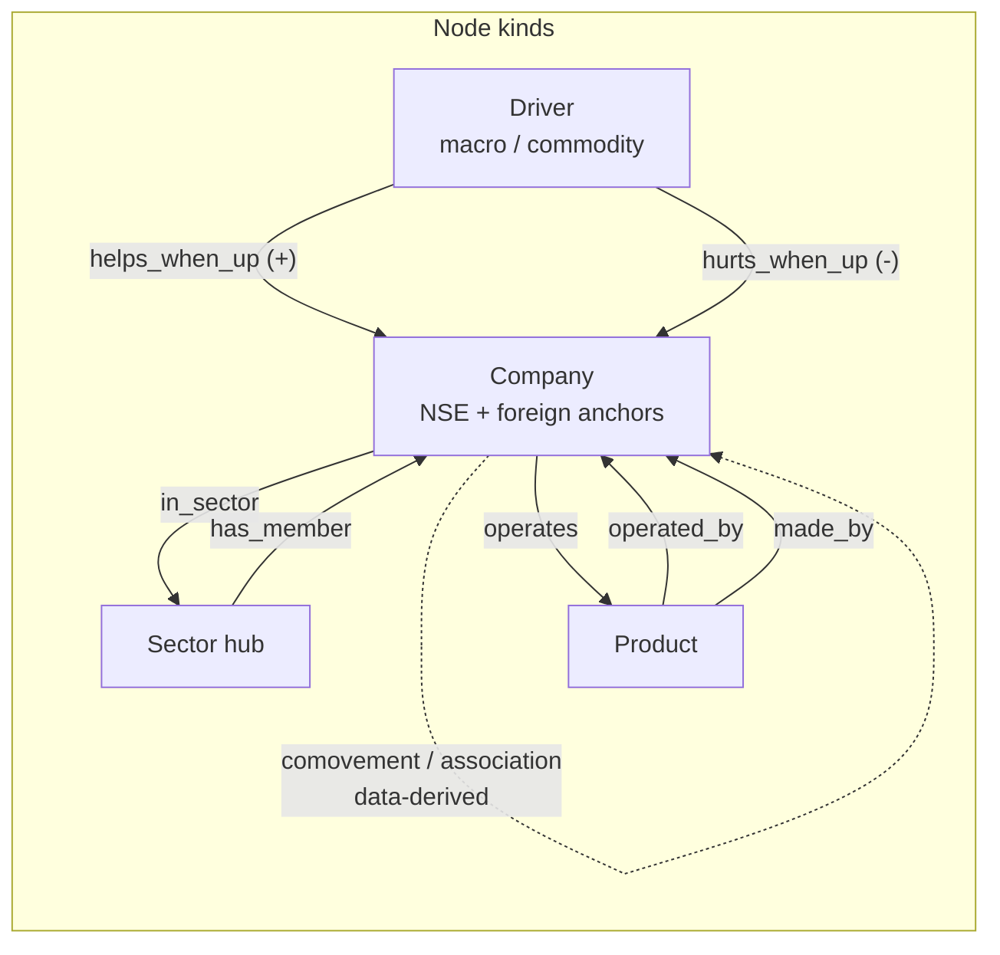
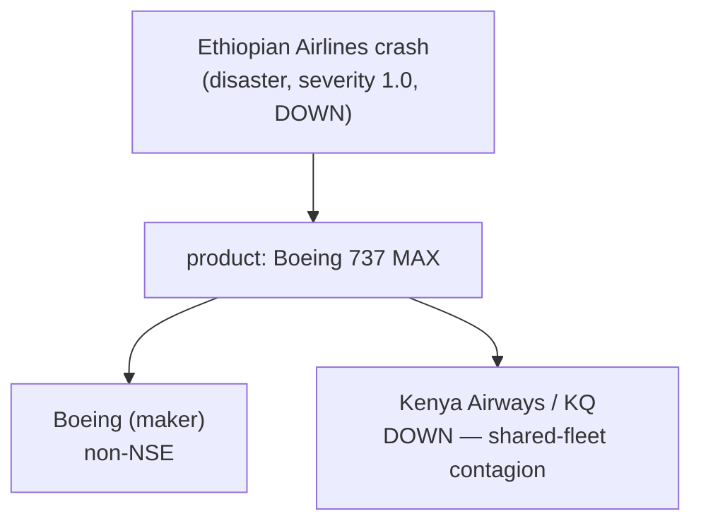
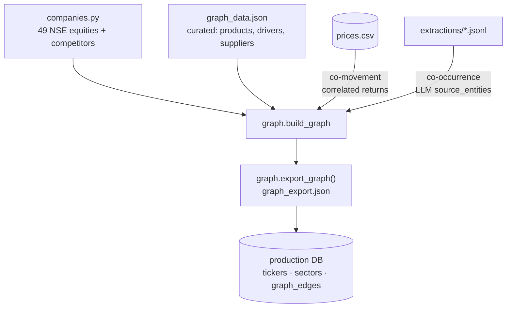

# StocksKE — Architecture

StocksKE predicts short-term price impact on the **Nairobi Securities Exchange
(NSE)** from news, by separating **perception** (an LLM reads an article and says
*what happened, to whom, how badly*) from **reasoning** (a knowledge graph
propagates that shock to every related company with decaying direction, magnitude
and confidence).

The design principle throughout: **the LLM should not need to know the
relationships** (that Kenya Airways flies Boeing, that banks gain from rate
hikes). The *graph* knows. The LLM only identifies the source event.

---

## 1. System overview

Three independent layers feed each other.

---

## 2. Pipeline data flow

The heart of the system. A relevance prefilter avoids paying for LLM calls on
irrelevant news; the validator drops hallucinated tickers; the graph turns one
source event into impact across many NSE names.

**LLM independence:** the extractor runs against any OpenAI-compatible endpoint
(`OPENAI_BASE_URL`) — OpenAI, Groq, or a local **Ollama** model — with no code
change.

---

## 3. The knowledge graph

Four node kinds and typed, weighted edges. The **sign** of an impact is not
stored on the edge; it comes from the per-event channel (`graph.CHANNEL`),
because the same structural link transmits differently per event (a rival's
earnings *beat* is mildly bad for you; a rival's *crash* is bad via a shared
product, not competitively good).

| Node kind | Examples | Role |
|---|---|---|
| **company** | KCB, KQ, Boeing\*, RwandAir\* | tradeable NSE names + non-NSE anchors (\*) |
| **sector** | `sector:Banking` | spillover hub linking peers |
| **product** | `product:Boeing 737 MAX` | shared physical asset (fleet contagion) |
| **driver** | `driver:CBK rate`, `driver:Oil price` | macro / commodity / shared-input hub |

Edge **families** (each a calibratable gain): `sector`, `competitor`, `product`,
`supplier`, `driver`, `cohort` (data-derived). Propagation is a signed
breadth-first spread with per-hop decay and a minimum-shock cutoff (always
terminates), emitting **direction + magnitude % + confidence + audit path** per
reached tradeable ticker.

### Worked example — foreign event reaching an NSE name

Kenya Airways is dragged down purely because the **graph** knows it shares the
Boeing fleet — the source event never names it.

---

## 4. Where the graph comes from (not hardcoded)

The graph is composed from layered sources so it can grow from evidence rather
than code edits, then exported as one artifact the production DB consumes.

- **Curated** structure lives in data files, not code.
- **Price co-movement** discovers statistical peers from correlated returns
  (point-in-time via `as_of` for leakage-free backtests).
- **Article co-occurrence** self-populates edges (with recency aging) and wires
  in novel entities the LLM names.

---

## 5. Component reference

| Component | File | Responsibility |
|---|---|---|
| Importer | `importer/importer.py` | Innova `.xls` → per-security → `prices.csv` (env-configurable URL, `probe` command, spreadsheet validation) |
| Collector | `pipeline/collector.py` | keyless RSS + article bodies + cross-run dedup |
| Extractor | `pipeline/extractor.py` | LLM → source event; relevance prefilter; lean token-efficient schema |
| Validator | `pipeline/validator.py` | reject hallucinated tickers / invalid fields |
| Graph engine | `pipeline/graph.py` | typed graph + signed propagation + calibration loading |
| Graph sources | `pipeline/graph_sources.py` | price co-movement, co-occurrence, driver validation |
| Aligner | `pipeline/aligner.py` | join predictions with realised prices (tolerant dates) |
| Calibrator | `pipeline/calibrate.py` | fit magnitude + structural coefficients → `calibration.json` |
| Harness | `pipeline/harness.py` | honest event-study backtest (abnormal returns, baselines) |
| Orchestrator | `pipeline/pipeline.py` | runs all steps + config validation + scorecard |

---

## 6. Production notes & honest limitations

Fixed and guarded:

- Tolerant date parsing (ISO timestamps no longer silently dropped); article
  dates backfilled from the source; EAT (not UTC) trading day.
- Relevance prefilter blocks ambiguous place/political tokens (`nairobi`,
  `limuru`, `jubilee`, …) that otherwise match nearly every article.
- Fuzzy ticker matching requires an exact match for single-token names
  (prevents e.g. "Equity Afia" → EQTY misattribution).
- Cross-run dedup store; configurable `robots.txt` fail-open/closed.
- Startup config validation; explicit warning when running on **uncalibrated**
  default coefficients.
- Point-in-time co-movement (`as_of`) and recency-aged co-occurrence edges.

Known limitations (documented, not silently assumed away):

- **Prices are daily closes** — the "1 hour" horizon in the original spec is not
  achievable without an intraday feed. Horizons are D / D+1 / D+3 / D+5.
- **Corporate actions** use a jump-heuristic, not a true adjusted-close feed.
- **Driver exposures** are curated and *unvalidated*; `validate_driver_exposures`
  is a data sanity-check, not proof of the signs.
- **Calibration** is on synthetic defaults until fit to real labeled NSE data.
- **A rigorous historical backtest** needs an archived news source; RSS is
  current-only, so the system runs live/forward (predict → validate as prices
  realise).
- **Extraction quality scales with the model.** A small local model has low
  yield; a stronger model (Groq/OpenAI) is a one-line `.env` change.
